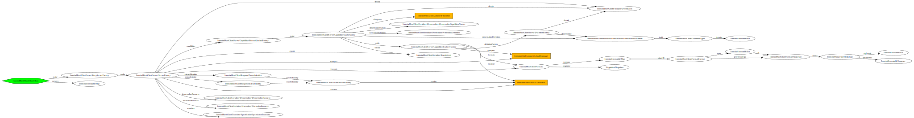

# RestClient

[](https://github.com/Innmind/rest-client/actions?query=workflow%3ACI)
[](https://codecov.io/gh/Innmind/rest-client)
[](https://shepherd.dev/github/Innmind/rest-client)


This library is intended to consume APIs built with the [`RestServer`](https://github.com/Innmind/rest-server).

## Installation

```sh
composer require innmind/rest-client
```

## Usage

```php
use function Innmind\Rest\Client\bootstrap;

$client = bootstrap(
    /* instance of Innmind\HttpTransport\Transport */,
    /* instance of Innmind\UrlResolver\ResolverInterface */,
    /* instance of Innmind\Filesystem\Adapter */
);

$client
    ->server('http://example.com/')
    ->capabilities()
    ->names();
```

This example would return all the resource available through the api of `http://example.com/`.

Then you can access the following method on any server: `all`, `read`, `create`, `update` and `remove`. Check the [interface](src/Server.php) to understand how to use these methods.

## Structure


